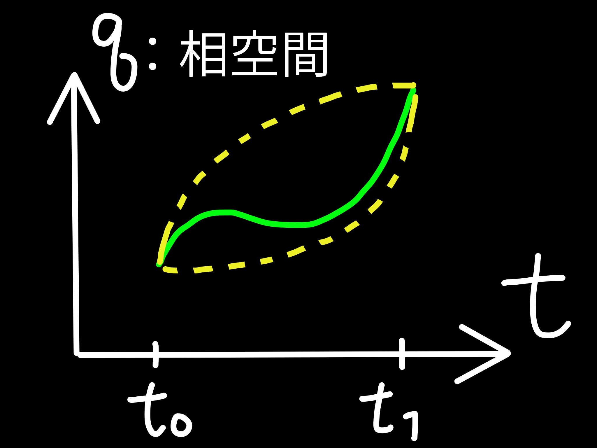
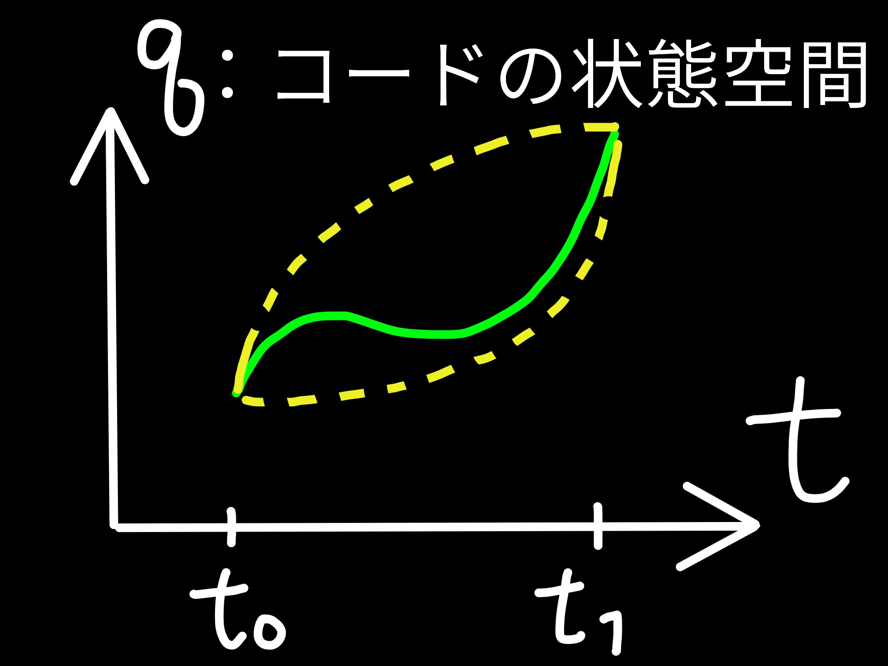

## diff 最小化原理で導く Zen of Python

@snap[south]
Pycon JP (2018-09-18)<br>
（株）いい生活 多田 吉克
@snapend

---

## 自己紹介

* 多田 吉克（🎉 @ta_dadadada）
* （株）いい生活 サービスプラットフォーム開発部
  * 自社サービス向け Web API の開発・運用
  * Python（Flask, Celery, SQLAlchemy）, MySQL, Apache
* エンジニア2年目

---

### Talk Theme

diff を減らして **いいコード** を書こう

* Pythonic なコードをかくための――好ましくはたったひとつの――さえたやり方

---

### Keywords

* OCP
  * 最小作用の原理
* diff
* Zen of Python

---

### OCP: Open/Closed Principle

* **開放/閉鎖原則**
* オブジェクト指向やデザインパターンの根底にある設計原理

@quote[モジュールは拡張に対して開いて （Open） おり，修正に対して閉じて （Closed）いなければならない](Bertrand Meyer)

---

### OCP が言っていること

ソフトウェアの機能追加するときには

* 機能実現のための実装を（独立に）加える
* 既存実装やモジュールの呼び出し箇所には修正が入らない

ように設計しておけ、ということ

* [Open-Closed Principle とデザインパターン](http://objectclub.jp/community/memorial/homepage3.nifty.com/masarl/article/dp-ocp-2.html)

---

### OCP のわかりやすい例

scikit-learn の API ``fit()`` や ``predict()``

* 本質的な機能の呼び出し方はクラスを変えても不変
* クラスを増やしても不変
* という状態が実現するような設計

```diff
-predictor = LogisticRegression(...)
+predictor = RandomForestClassifier(...)
predictor.fit(X_train, Y_train)
predictor.predict(X_test)
```

---

### OCP のご利益

ソフトウェアの **ライフタイム** 全体でのコストを最小化する

---

### How to OCP

* 将来の改修コストが減るようにデザイン
* 修正によって発生する diff をできるだけ削減する

---

### diff 最小化原理

「修正の diff を最小にする」という指針で実装していけば最適なコードに辿りつくのではないか？（仮説）

* 考え方としては物理学の最小作用の原理に似ている
* ただしやり方としては greedy

---

@snap[north]
**最小作用の原理**
<br>
「作用（≠力）」を最小化する軌跡が実現するという力学の原理
@snapend

@snap[south-west]

@snapend

@snap[south-east]

@snapend

---

## 実践

---

### Python で diff を少なくする方法

実例集

---

### trailing comma

```py
from flask import abort, json, Flask, request

from flask import (
    abort,
    json,
    Flask,
    request,
)
```

* module を追加/削除したい

---

### trailing comma ②

```diff
# bad 脳内で突き合わせが必要な長い diff
-from flask import json, Flask, request
+from flask import abort, json, Flask, request, send_file

# good 修正内容がひと目で把握できる
 from flask import (
-    abort,
     json,
     Flask,  
     request,
+    send_file,
 )
```

* お尻の ``,`` が大事（無いと diff が2行でる）

---

### 早期リターン①

```py
def do_all(data)
    if data:
        do_something1(data)
        do_something2(data)
```

```py
def do_all(data):
    if not data:
        return
    do_something1(d)
    do_something2(d)
```

---

### 早期リターン②

* 条件が増えると無用な diff が増える

```diff
 def do_all(data)
     if data:
-        do_something1(data)
-        do_something2(data)
+        if data.prop == 'hoge':
+            do_something1(data)
+            do_something2(data)
```

```diff
 def do_all(data):
     if not data:
         return
+    if data.prop != 'hoge':
+        return
     do_something1(d)
     do_something2(d)
```

---

### デコレータ①

* 例えば「ログインユーザしかアクセスできない処理」

```py
@app.route('/history/<int:user_id>')
def get_history(user_id):
    if not is_login(user_id):
        return redirect(url_for('login'))
    else:
        return do_something(user_id)

@app.route('/profile/<int:user_id>')
def get_profile(user_id):
    if not is_login(user_id):
        return redirect(url_for('login'))
    else:
        return do_another_thing(user_id)

```

---

### デコレータ②

* 無用な条件分岐は隠蔽してすっきり

```py
from flask_login import login_required

@app.route('/history/<int:user_id>')
@login_required
def get_history(user_id):
    return do_something(user_id)

@app.route('/profile/<int:user_id>')
@login_required
def get_profile(user_id):
    return do_something(user_id)
```

+++

### `login_required` の実装

```py
def login_required(func):
    @wraps(func)
    def decorated_view(*args, **kwargs):
        if request.method in EXEMPT_METHODS:
            return func(*args, **kwargs)
        elif current_app.config.get('LOGIN_DISABLED'):
            return func(*args, **kwargs)
        elif not current_user.is_authenticated:
            return current_app.login_manager.unauthorized()
        return func(*args, **kwargs)
    return decorated_view
```

---

他にも Mixin や Context Manager など・・・

---

## Zen of Python にたどり着く

Tim Peters 氏が示した Python 設計 19 の指針

```python
import this
```

+++

## Zen of Python （訳：多田）

+++

* Beautiful is better than ugly.

    醜いよりも美しい方が良い。

* Explicit is better than implicit.

    暗黙的であるよりも明示的であるほうが良い。

* Simple is better than complex.

    複雑であるよりも単純な方が良い。

* Complex is better than complicated.

    それでも、難解であるよりは複雑な方がマシ。

+++

* Flat is better than nested.

    入れ子状になるよりも凹凸のない方が良い。

* Sparse is better than dense.

    ぎっしりつまっているより空いていたほうが良い。

* Readability counts.

    可読性はすごく重要。

+++

* Special cases aren't special enough to break the rules.

    特例だったとしてもルールを破ってよいほど特別というわけではない。

* Although practicality beats purity.

    とはいえ、実用性は純正であることに勝る。

+++

* Errors should never pass silently.

    エラーを黙って見過ごすべきではない。

* Unless explicitly silenced.

    ただし明示的に黙らせている場合は除く。

* In the face of ambiguity, refuse the temptation to guess.

    あいまいなものに直面したときは、憶測で済ませたくなる誘惑をはねのけること

+++

* There should be one-- and preferably only one --obvious way to do it.

    明らかなやり方が――好ましくはたったひとつだけ――あるはずだ。

* Although that way may not be obvious at first unless you're Dutch.

    けれどもそのやり方が、最初は明快ではないかもしれない。君がオランダ人でないならね。

+++

* Now is better than never.

    ずっとやらないよりは今やったほうがいい。

* Although never is often better than *right* now.

    けれど *今すぐ* やるよりは一生やらないほうがマシなこともよくある。

+++

* If the implementation is hard to explain, it's a bad idea.

    実装の説明が難しいなら、そのアイデアはイケてない。

* If the implementation is easy to explain, it may be a good idea.

    実装の説明が簡単なら、いい感じだ。たぶんきっと。

+++

* Namespaces are one honking great idea -- let's do more of those!

    名前空間はマジでイケてる -- ガンガン使っていこう！

---

### 恣意的にいくつか抜粋（意訳付）

* Readability counts.（可読性はすごく重要）

* There should be one-- and preferably only one --obvious way to do it.（明らかなやり方が――好ましくはたったひとつだけ――あるはずだ。）

* If the implementation is easy to explain, it may be a good idea.（実装の説明が簡単なら、いい感じだ。たぶんきっと）

---

### 変更が小さいということは

* 可読性が高い
* 説明もかんたん
* diff を *最小にする* やり方はきっと1つ
  * 必然的に python の言語機能やライブラリを活用することになるのが大きな理由

diff 最小化原理は良い指針になるのでは？

---

### diff 最小化原理のご利益

* **diff をなるべく小さくする** という明快な目標のほうがゴールを目指しやすい
  * 「――原則を守ろう」は抽象的、初学者には難解なことが多い
  * もちろんこれだけでは至らない部分もある

---

### 結論

diff 最小化原理で **いいコード** を書こう

---

### まとめ

* **OCP** (Open/Closed Principle) という考え方がある
* OCP に従うには **diff 最小化原理** に従えば良いのではないか（仮定）
* 実際 Python は小さな修正で豊かな機能をできる言語
* diff最小化を心がければ自然と **Zen of Python** に従うコードがかける（はず）

長いものには巻かれよう！


